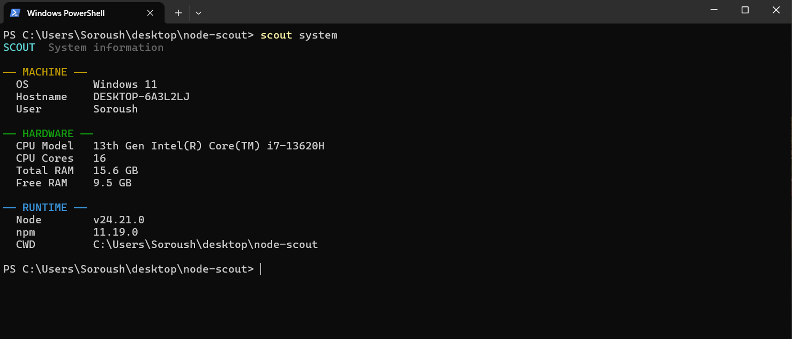
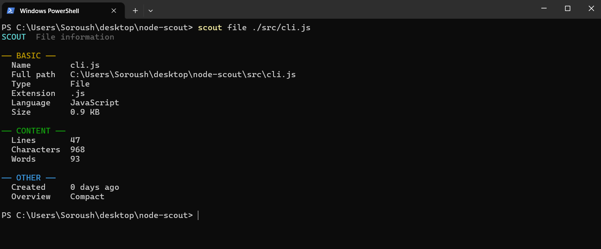
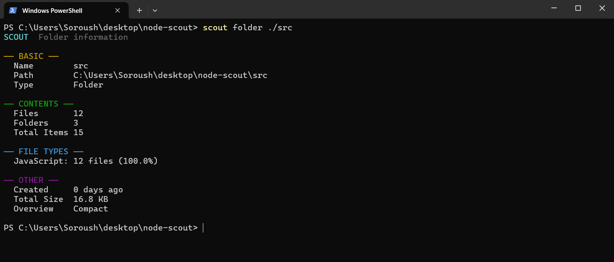
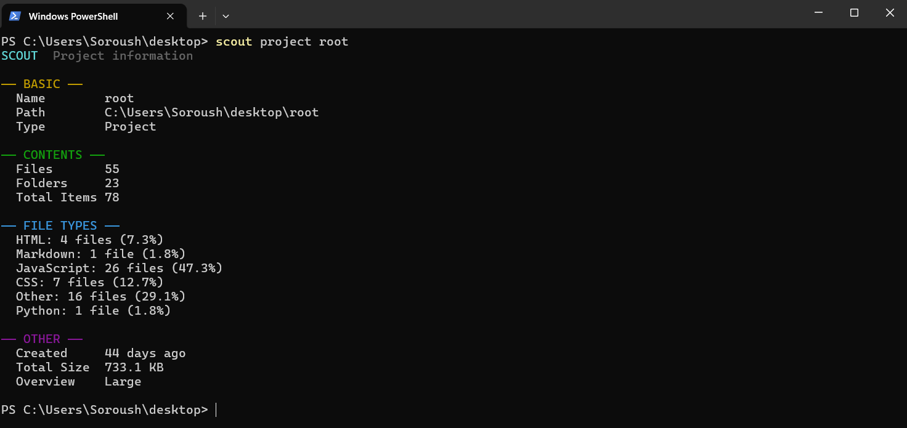

# 🔎 Node Scout

> A fast Node.js CLI tool to analyze files, folders, and projects from your terminal.

[](https://www.npmjs.com/package/node-scout)
[](https://www.npmjs.com/package/node-scout)
[](https://github.com/soroushosouli/node-scout/blob/main/LICENSE)
[](https://nodejs.org/)

Node Scout helps you inspect any codebase in seconds. Run one command and get file stats, folder structure, project languages, total size, and system information — without opening multiple tools.

## Table of Contents

- [Why Node Scout?](#why-node-scout)
- [Demo](#demo)
- [Features](#features)
- [Installation](#installation)
- [Usage](#usage)
- [Examples](#examples)
- [Why It's Fast](#why-its-fast)
- [Project Structure](#project-structure)
- [Roadmap](#roadmap)
- [Contributing](#contributing)
- [License](#license)

## Why Node Scout?

Checking a project manually takes time. You open files, check folders, count files, check sizes, and run different commands.

**Node Scout puts this information in one place.**

## Demo






## Features

### 📄 Files

Analyze any file and see:

- File type & language
- File size
- Lines, words & characters
- Creation date
- More useful details

### 📁 Folders

Analyze any folder and see:

- File count
- Folder count
- Total size
- Contents
- More useful details

### 🗂️ Projects

Analyze a whole project and see:

- Project structure
- Languages used
- File statistics
- Total size
- More useful details

### 💻 System

Node Scout can also show useful information about your system.

## Installation

Requires Node.js 16+.

```bash
npm install -g node-scout