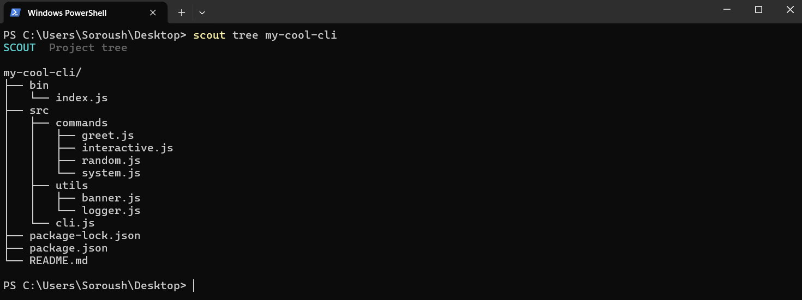

# 🔎 Node Scout

> A fast Node.js CLI tool to analyze files, folders, and projects from your terminal.

[](https://www.npmjs.com/package/node-scout)
[](https://www.npmjs.com/package/node-scout)
[](https://github.com/soroushosouli/node-scout/blob/main/LICENSE)
[](https://nodejs.org/)

Node Scout helps you inspect any codebase in seconds. One command gives you file stats, folder structure, project languages, total size, and system info.

## Contents

- [Demo](#demo)
- [Features](#features)
- [Install](#install)
- [Usage](#usage)
- [Examples](#examples)
- [Contributing](#contributing)
- [License](#license)

## Demo





## Features

**📄 Files** — type, language, size, lines, words, characters, created date.

**📁 Folders** — file count, folder count, total size, contents.

**🗂️ Projects** — structure, languages, file stats, total size.

**📋 Custom Ignore List** — Add files/folders to the list you don't want to be scanned in project scanning.

**🌳 Folder Tree** — Folder tree visualizer.

**💻 System** — useful info about your machine.

## Install

Requires Node.js 16+.

```bash
npm install -g node-scout
```

Or run without installing:

```bash
npx node-scout --help
```

## Usage

```bash
scout <target> <path>
```

| Target    | Description               |
|-----------|---------------------------|
| `file`    | Analyze a single file     |
| `folder`  | Analyze a folder          |
| `project` | Analyze an entire project |
| `system`  | Show system information   |
| `tree`    | Show folder tree          |


Other commands: `scout help`, `scout version`, `scout ignore add/remove`.

## Examples

```bash
scout project ./my-project
scout folder ./src
scout file package.json
scout tree ./myproject
scout system
scout ignore add assets
```

Example output for `scout project ./my-project`:

```text
Project: my-project
Files: 128
Folders: 24
Languages: JavaScript, TypeScript, JSON, Markdown
Total size: 4.8 MB
```

## Contributing

[](https://github.com/soroushosouli/node-scout/pulls)

Found a bug or have an idea? Contributions are welcome.

1. Fork the repo
2. Create a branch
3. Commit your changes
4. Open a pull request

## License

MIT